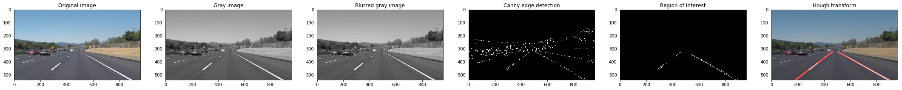

# **Finding Lane Lines on the Road** 

---

### Reflection

### 1. Describe your pipeline. As part of the description, explain how you modified the draw_lines() function.

My pipeline consisted of 5 steps:
-  First, I converted the images to grayscale. Because in the grayscaled image, we can represent a pixel using a single value and  we can calculate the derivatives conveniently. 
-  Then, I used Gaussian Blur to eliminate some noises. 
-  Next, I deployed Canny edge detection. In this step, I tuned the low_threshold and high_threshold to get a acceptable result. Canny detection calculates the derivatives over the grayscaled image and decides whether the pixels should be combined as a line. The detection procedure returned some seperate  edges. However, this step was just image processing rather than computer vision. In computer vision, we should find something meaningful like the lanes or other patterns. 
-  Since there were too many areas that we didn't care, I masked a region of interest to highlight the lane area. Actually, this step can be placed at previous steps. But that didn't affect too much. So I just placed the step here. 
-  Finally, I implemented Hough transform. The transform could find some patterns , in this case the straight lane lines. There are several paramters should be tuned. 

To visualize the procedure, I also implemented some plot functions. During and after the pipline construction, I checked the plots, tuned many parameters and iterated the procedure. Understanding the parameters and knowing their effects certainly helped me a lot in the tuning phase. 

In order to draw a single line on the left and right lanes, I modified the draw_lines() function. First, I calculated the slopes of each edge. Since the camera is usually mounted at the center of the car, the lane lines should be two straight lines with nearly opposite slopes. So we can check the sign of the slope to seperate them into two groups, the left line group and the right line group. Considering some noises like horizontal edges of the road surface, I set a threshold of slope to filter. 

To show how the pipline works, I included an image: 

### 2. Identify potential shortcomings with your current pipeline

One potential shortcoming would be that there are too many parameters depending on manual tuning.  

Another shortcoming could be that this pipline cannot handle noises well. In many cases, for example  the optional challenge, there are lots of noises, skid marks, broken surface, seams of different parts, and etc, in the image. 

Also in case of low contrast, like low illumination or shading, it is hard to seperate the yellow or white lanes. 

### 3. Suggest possible improvements to your pipeline

For the parameter issue, we have few tools unless we try new algorithms. 

For the nearly horizontal noises, we can filter them by choosing an appropriate threshold of slope in the draw_line function. However, this has no effects on the vertical noises. Maybe we can reduce the vertical noises by removing the vertical outliers. Tuning the low_threshold in Canny detection or tuning the paramters in Hough transform may be another way. However, this approach couples too many effects and we can hardly tune a parameter independently. 

for the contrast issue, we can try image enhancement to increase the constrast. However, this method would also magnify the moise issue. We can also try to select the yellow or white regions since only the lanes we care. 

### 4. Attempts on the optional challenge

As expected, I met all the three potential shortcomings when I tested my pipline on the challenge. 

First, I tried to tune the slope threshold to filter the noises. It had good results on the horizontal noises but failed on the vertical noises. However, It was acceptable as long as the lane lines were correctly detected since vertical noises made up only a very small portion. 

I thought the biggest challenge as the contrast issue. In this challenge task, shading of trees, brighter road surface and others all contributed to the degradation of contrast, which made it harder to distinguish the lanes in the grayscaled image. First, I tried image enhancement of grayscale histogram balancing. Then I realized that image enhancement would also magnify the noises. So I tried to directly select the yellow and white colors. Only these two colors we concern. If we select the colors and paint other colors in black, we would make a great step. I tried to seperate the colors in RGB space but I failed. I noticed that the color values were coupled with illumination in RGB space. Then I searched the web and found [this post](https://www.learnopencv.com/color-spaces-in-opencv-cpp-python/).  The post  compares several color spaces and points out their pros and cons. So next I tried the HSV space. Though it ought to be better than RGB space, I spent some time and still haven't found an acceptable solution until now. 

Above is my attempts. Autonomous driving is a huge project. We should consider a plenty of scenarios, especially the boundaries in realistic environment. From theoretical perspective to engineering perspective, there is still much work to be done.  

